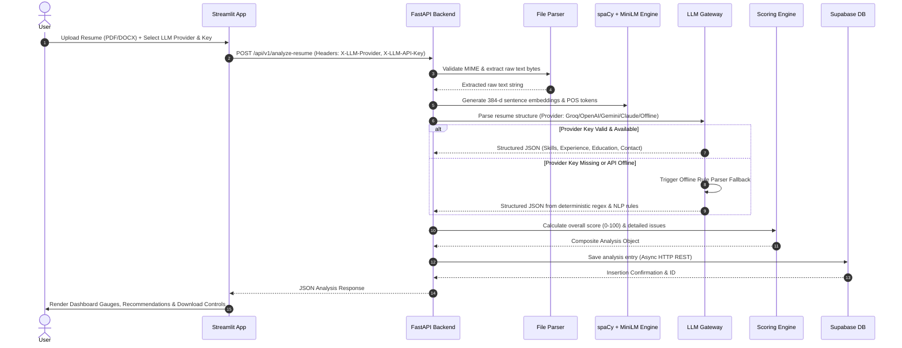
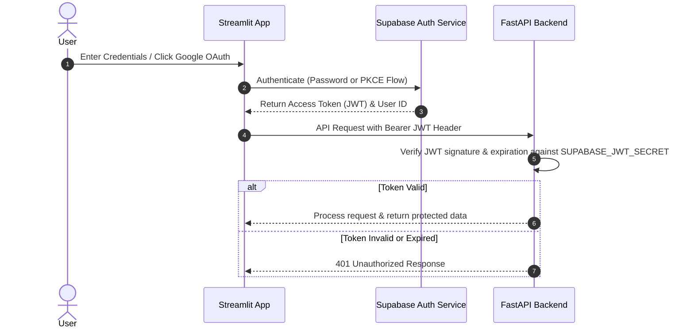
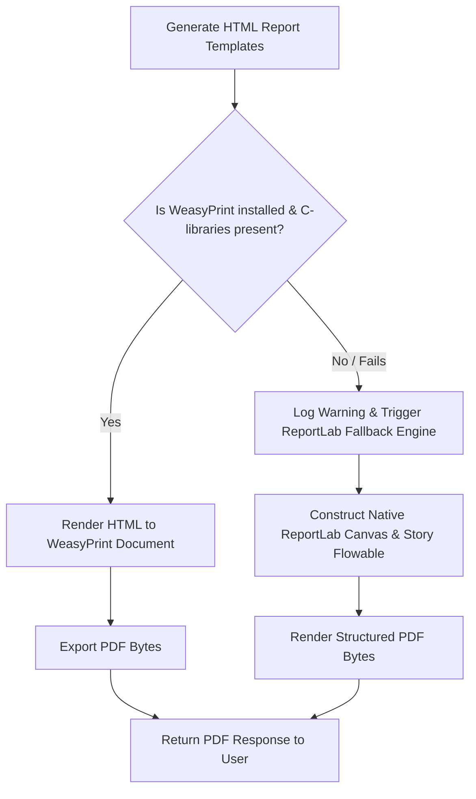

# System Architecture Specification — Resumely

## 1. System Overview & Architecture Philosophy

Resumely is designed around a **Decoupled Stateless Architecture** paired with a **Hybrid Execution Model**. It isolates compute-heavy NLP operations (spaCy entity recognition, Sentence Transformer vector embeddings) and external LLM API communications from the frontend presentation tier.

```mermaid
+-----------------------------------------------------------------------------------+
|                               Presentation Tier                                  |
|                             Streamlit Web Application                             |
|  - UI Views (Landing, Scorer, History, Resources)                                |
|  - Auth State Management (Supabase Auth & PKCE OAuth)                            |
|  - Dynamic LLM Provider Selector & Custom Key Header Injector                     |
+-----------------------------------------------------------------------------------+
                                         |
                                         | REST / HTTPS JSON & Form Data
                                         v
+-----------------------------------------------------------------------------------+
|                               Application API Tier                                |
|                                FastAPI Server Framework                           |
|  +-----------------------------------+     +-----------------------------------+  |
|  | CORS & Auth Security Middleware   |     | Request Validation (Pydantic v2)  |  |
|  +-----------------------------------+     +-----------------------------------+  |
|                                         |                                         |
|  +-----------------------------------------------------------------------------+  |
|  |                           Core Processing Pipeline                           |  |
|  |  1. Document Parser & MIME Validator (pdfplumber / docx / python-magic)     |  |
|  |  2. NLP Entity & Vector Engine (spaCy en_core_web_md + all-MiniLM-L6-v2)    |  |
|  |  3. Multi-Provider LLM Gateway Adapter (Groq / OpenAI / Gemini / Claude)    |  |
|  |  4. Deterministic Offline Rule Parser & Scorer Fallback Engine              |  |
|  |  5. Report Export Engine (ReportLab / WeasyPrint Dual Strategy)             |  |
|  +-----------------------------------------------------------------------------+  |
+-----------------------------------------------------------------------------------+
                                         |
                                         | Async REST Calls
                                         v
+-----------------------------------------------------------------------------------+
|                                Data & Cloud Services                              |
|  - Supabase PostgreSQL (User Analysis History & Row Level Security)               |
|  - External LLM Provider APIs (Groq, OpenAI, Google Gemini, Anthropic)           |
+-----------------------------------------------------------------------------------+
```

---

## 2. Logical Architecture & Request Lifecycles

### 2.1 Complete Resume Analysis Lifecycle

The sequence below documents how an incoming resume payload moves through validation, parsing, embedding generation, LLM adaptation, scoring, and history persistence.



---

## 3. Core Technical Flow Specifications

### 3.1 Authentication & Token Verification Flow



### 3.2 PDF Report Generation Strategy (Dual Strategy Architecture)

To guarantee zero PDF export crashes across operating systems (especially Windows machines missing GTK/Pango C-libraries), Resumely uses a dual-engine export pattern:



---

## 4. Component Interaction & Interface Contracts

### 4.1 Interface Contract: Multi-LLM Provider Gateway

All provider adapters implement the `BaseLLMProvider` contract:

```python
class BaseLLMProvider:
    def parse_text(
        self,
        system_prompt: str,
        user_prompt: str,
        api_key: Optional[str] = None
    ) -> Optional[Dict]:
        """
        Executes text parsing request against provider API.
        Returns parsed JSON dict or None on failure/absence of key.
        """
        raise NotImplementedError
```

### 4.2 Scoring Formula Specifications

The overall ATS Score $S_{total} \in [0, 100]$ is computed as:

$$S_{total} = w_f \cdot S_f + w_k \cdot S_k + w_c \cdot S_c + w_s \cdot S_s + w_a \cdot S_a$$

Where:

- $S_f$: Formatting Score (Max 20 pts) — Evaluated by section header coverage and bullet point structure.
- $S_k$: Keyword Score (Max 25 pts) — Evaluated by keyword volume and JD fuzzy match ratio.
- $S_c$: Content Quality Score (Max 25 pts) — Evaluated by action verb count and quantified achievement density.
- $S_s$: Skill Validation Score (Max 15 pts) — Evaluated by percentage of skills backed by experience entries.
- $S_a$: ATS Compatibility Score (Max 15 pts) — Evaluated by layout single-column structure and lack of forbidden elements.
- Weights: $w_f=1.0, w_k=1.0, w_c=1.0, w_s=1.0, w_a=1.0$.

---

## 5. Deployment & Physical Architecture

```mermaid
                                 [ Cloud / On-Prem Network ]
                                              |
                        +---------------------+---------------------+
                        |                                           |
                        v                                           v
           +-------------------------+                 +-------------------------+
           | Streamlit Frontend Pod  |                 |  FastAPI Backend Pod    |
           | Port: 8501              |                 |  Port: 8000             |
           | Memory: ~300 MB         |                 |  Memory: ~1.2 GB        |
           +-------------------------+                 +-------------------------+
                        |                                           |
                        +---------------------+---------------------+
                                              |
                                              v
                              +-------------------------------+
                              |    Supabase Cloud Services    |
                              |  - Auth & OAuth Engine        |
                              |  - PostgreSQL Database        |
                              +-------------------------------+
```

### Resource Requirements & Deployment Profile

- **Python Runtime**: Python 3.10+ / 3.11 / 3.12 (64-bit AMD64).
- **Backend Memory Baseline**: ~1.2 GB RAM (driven by spaCy `en_core_web_md` and Sentence Transformer `all-MiniLM-L6-v2` loaded into memory during startup).
- **Frontend Memory Baseline**: ~250 MB RAM.
